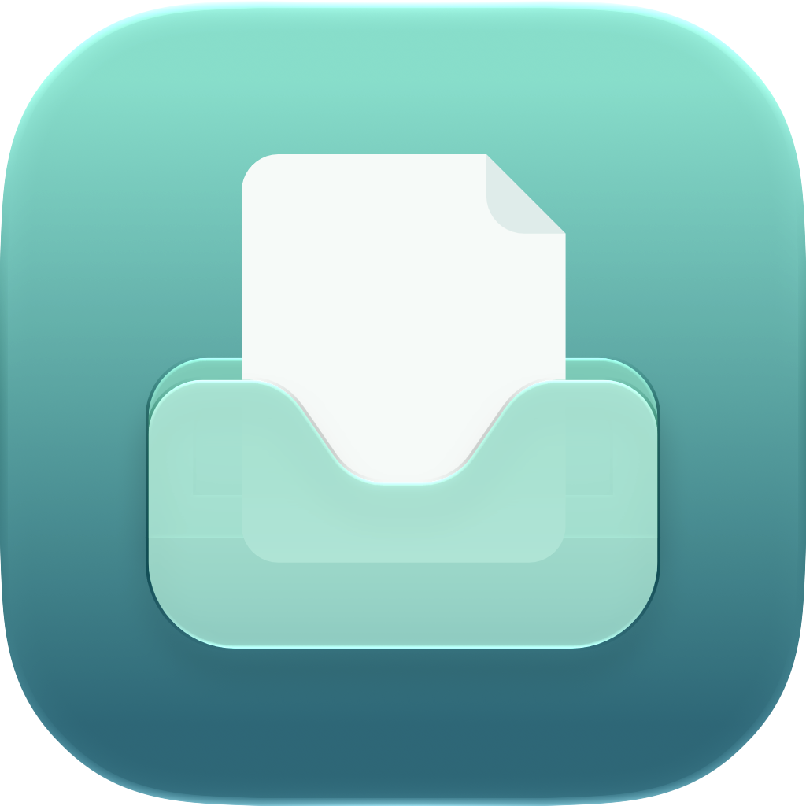

<p align="center">
  
</p>

<h1 align="center">Layby</h1>

<p align="center">English | <a href="README.zh-CN.md">简体中文</a></p>

<p align="center">A handy place for files you’ll need in a moment.</p>

Layby is a macOS file shelf built with Swift and SwiftUI / AppKit. Drag files onto the floating shelf, release the mouse, then drag them out once you’ve found the destination window. You can also collect files from different folders and drag them out together.

## Features

- **Quick activation**: Shake the mouse while dragging files, hold a modifier key, or drag to the notch area. A global keyboard shortcut and a menu bar entry are also available.
- **File collection**: Accept files, folders, and files provided by other apps through File Promises. Drag the whole stack or expand it to select individual files.
- **Views and selection**: Switch between a thumbnail grid and a file list, with multiple selection, keyboard navigation, copying, and Reveal in Finder.
- **Folder browsing**: Double-click a folder to browse its contents, navigate back through each level, and preview, copy, or drag files directly.
- **Quick Look**: Select a file and press Space to preview it with native macOS Quick Look.
- **Collapse and dock**: Collapse the shelf into a mini capsule that still accepts files, or drag it to the top center of any display to dock it.
- **File services**: Send files to macOS Services provided by installed apps using the context menu or the services button on the stack. Available services depend on your installed apps and system permissions.
- **Multiple languages**: Follow the system language or switch languages in settings, with changes applied immediately.

## Installation

Requires **macOS 15.6 or later**.

### Homebrew

Install Layby from its Homebrew tap:

```sh
brew tap gonnabeafreeman/layby
brew trust gonnabeafreeman/layby
brew install layby
```

After installation, you can find it in your **Applications** folder.

### Manual installation

Download a prebuilt app archive or `.dmg` from [GitHub Releases](https://github.com/gonnabeafreeman/Layby/releases). No source build is required. Choose an app attachment for the release, rather than GitHub’s automatically generated `Source code` archives.

- **App archive**: Extract the archive, then drag `Layby.app` into your **Applications** folder.
- **DMG**: Double-click the `.dmg`, drag `Layby.app` into your **Applications** folder, then eject the disk image after copying finishes.

### First launch: Allow the unverified app

Prebuilt release apps are **not signed with an Apple Developer ID certificate or notarized by Apple**. On first launch, macOS may report that the developer cannot be verified or that Apple cannot check the app for malicious software. Once you’ve confirmed that the app came from this project’s Releases page:

1. Double-click `Layby.app` in **Applications**.
2. When the verification warning appears, click **Cancel** (**Done** on some macOS versions). Do not choose **Move to Trash**.
3. Open ** → System Settings → Privacy & Security** and scroll down to **Security**.
4. Find the message saying Layby was blocked and click **Open Anyway**.
5. Authenticate with your password or Touch ID if prompted, then click **Open** in the confirmation dialog.

macOS will remember the exception, so you can open the app normally afterward. If **Open Anyway** is missing, try opening `Layby.app` again, then return to **Privacy & Security**.

See [Apple’s official guide](https://support.apple.com/en-us/102445) for details.

## Usage

1. Start dragging files in Finder or another app, then shake the mouse or hold **Shift** to show the shelf.
2. Drop the files onto it, then switch to the destination folder or app.
3. Drag the file stack to take all files at once. Click the file count button at the bottom to expand the grid or list and choose specific files.

The default global shortcut is **⌃⌥Space** (Control + Option + Space). Activation methods, modifier keys, the shortcut, and shake sensitivity can all be adjusted in settings. On displays without a notch, you can enable the option to use the top center of the screen instead.

Click the top bar to collapse or expand the shelf, or drag it to move the window. Release it near the top center of any display to dock it below the notch, or below the menu bar on displays without a notch. To undock it, drag the top bar away from that area.

### Keyboard and mouse controls

These file actions apply to the expanded grid or list.

| Action                | Result                                                                                                   |
| --------------------- | -------------------------------------------------------------------------------------------------------- |
| ⌘-click / Shift-click | Toggle selection / Select a contiguous range                                                             |
| Arrow keys            | Move selection                                                                                           |
| ⌘A                    | Select all ready files at the current level                                                              |
| ⌘C                    | Copy selected files for pasting in Finder                                                                |
| Space                 | Open or close Quick Look                                                                                 |
| Double-click a folder | Browse its contents                                                                                      |
| Delete                | Remove selected items from the shelf without deleting the originals; unavailable while browsing a folder |
| Esc                   | Close Quick Look first; otherwise close and clear the shelf                                              |
| ⌘W                    | Close and clear the shelf                                                                                |

### How are files handled?

Regular files stay in their original locations; Layby stores references to them. Dragging files out uses a copy operation. Items remain on the shelf after a successful drag so you can use them again.

**Closing the shelf clears all items, leaving it empty the next time you open it.** Collapsing it into a capsule preserves its contents, selection, and current browsing location. Shelf contents are not restored after restarting the app.

Files supplied by other apps through File Promises are saved as temporary copies and cleaned up when the relevant operations finish. Temporary copies handed to file services remain until the app quits so external apps can read them asynchronously. Removing items or clearing the shelf does not delete your original files.

Layby currently accepts files and folders. Plain text and web links cannot be stored directly.

### Drag activation not working?

Check that the relevant activation method is enabled in Layby settings. If shaking files in other apps does not work, allow Layby in **System Settings → Privacy & Security → Accessibility**, then check again in Layby settings. The global shortcut and manual file drops remain available.

The app exclusion list in settings matches apps by Bundle ID. It only disables shake and modifier-key activation within those apps.

## Building from source

The project has no third-party dependencies. The Xcode project builds the app; `Package.swift` runs the tests.

### Xcode

Use an Xcode version that supports the macOS 27 SDK and open the project:

```sh
open Layby.xcodeproj
```

Select the `Layby` scheme and `My Mac`, then press `⌘R` to run. If you encounter signing issues, select your own development team in Signing & Capabilities.

### Command line

With Xcode or Command Line Tools that include the macOS 27 SDK installed, run from the repository root:

```sh
bash scripts/build-local.sh
open build/local/Layby.app
```

The script uses `xcrun` to select the compiler and SDK, builds for your Mac’s architecture, and applies a local ad-hoc signature. Output defaults to `build/local/Layby.app`; set `LAYBY_BUILD_DIR` to use a different output directory.

## Testing and development

```sh
swift test
```

Tests cover drag activation, file lifecycle, selection and navigation, folder browsing, window layout, the capsule, docking across multiple displays, and file services. Some tests use native windows and the clipboard, so they require a logged-in macOS session with desktop access. If the Testing macro fails to load with Command Line Tools, see the [test instructions (Chinese)](docs/mini-capsule.md#验证).

Two additional scripts test native UI behavior and briefly show test windows or menus:

```sh
bash scripts/test-quick-look.sh
bash scripts/test-services-popup.sh
```

Code under `Layby/` is organized by responsibility: `Activation/` handles activation, `Shelf/` manages state and UI, `Files/` handles file access and folder browsing, `Platform/` integrates native windows, drag and drop, Quick Look, and Services, and `Settings/` manages preferences and languages.

For interaction details, see the documentation on [folder browsing](docs/folder-browsing.md), [Quick Look](docs/quick-look.md), [the mini capsule](docs/mini-capsule.md), [notch docking](docs/notch-docking.md), and [file services](docs/file-services.md) (in Chinese).

Issues and pull requests are welcome. When reporting drag-and-drop problems, include your macOS version, source app, activation method, and steps to reproduce. For notch or multiple-display issues, also describe your display setup.
